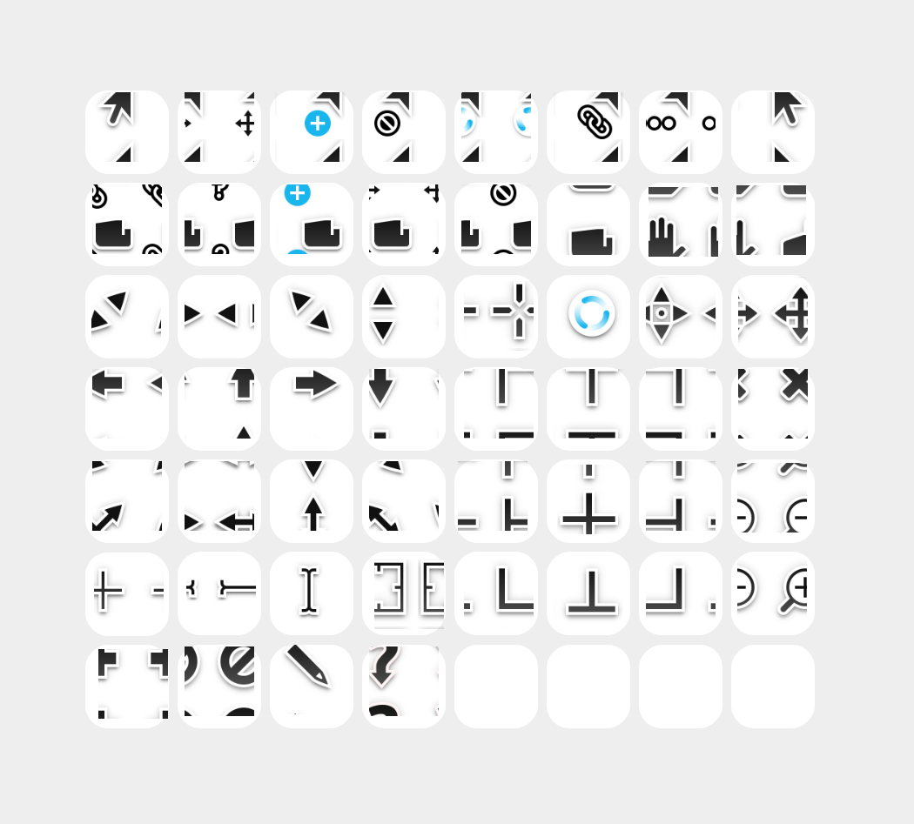

# Yaru Left Handed Cursor

A set of left-handed cursors for left-handed people. Flipped the right-hand Yaru cursors and made hotspot adjustments. As a bonus, this cursor set has a black hand!

## Installation
- Download the repository.
- (Optional) Unzip the downloaded file and remove `index.php` and `README.md`.
- Copy the whole directory into `~/.icons` (current user only) or `/usr/share/icons/` (globally available).
- Use the GNOME Tweaker application to choose the cursor.

## Preview
